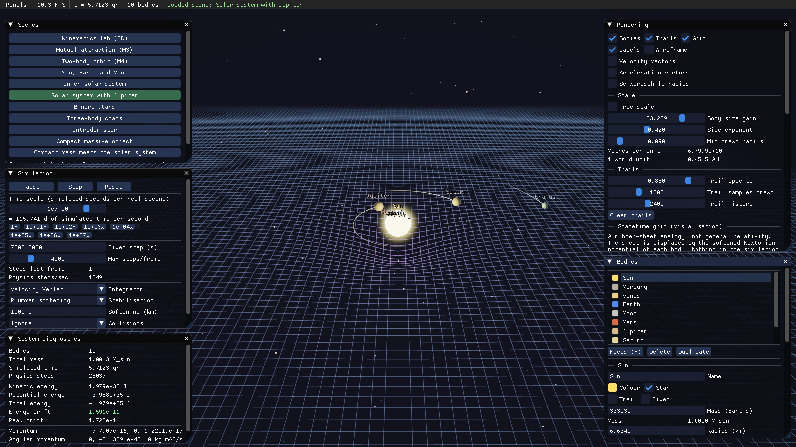
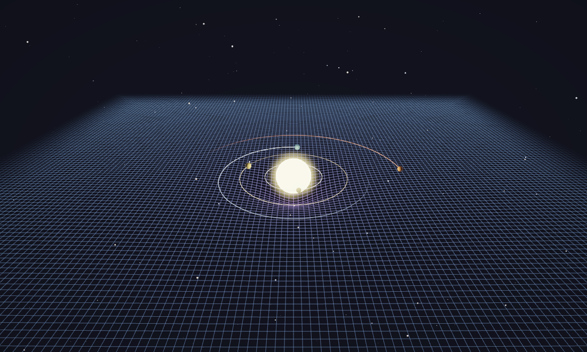
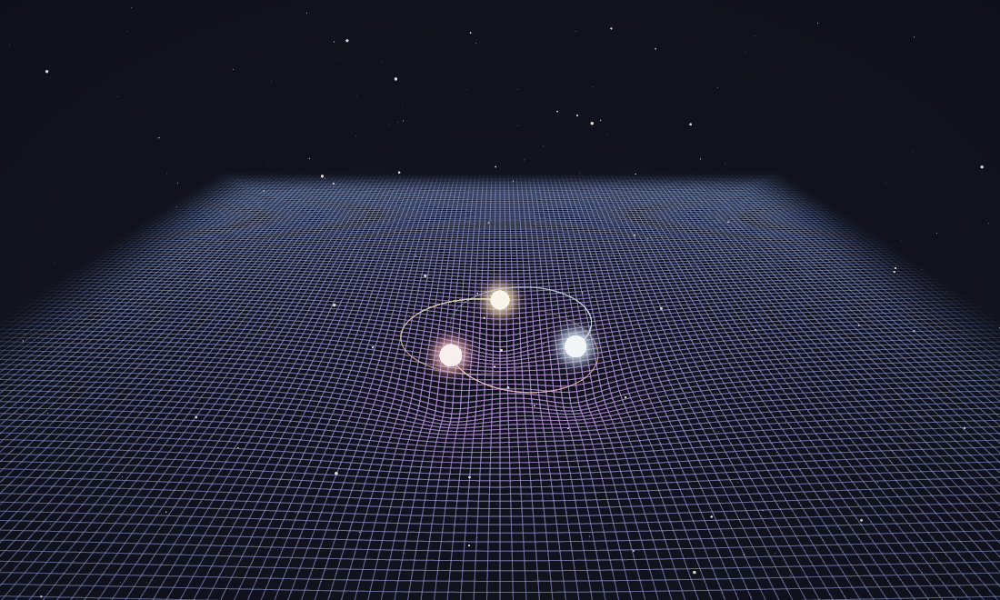
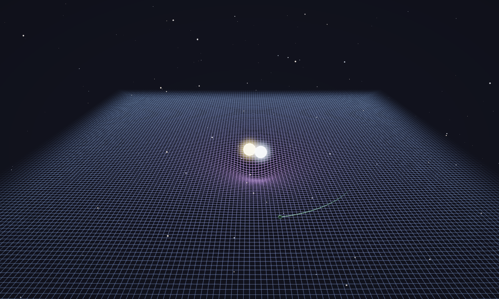
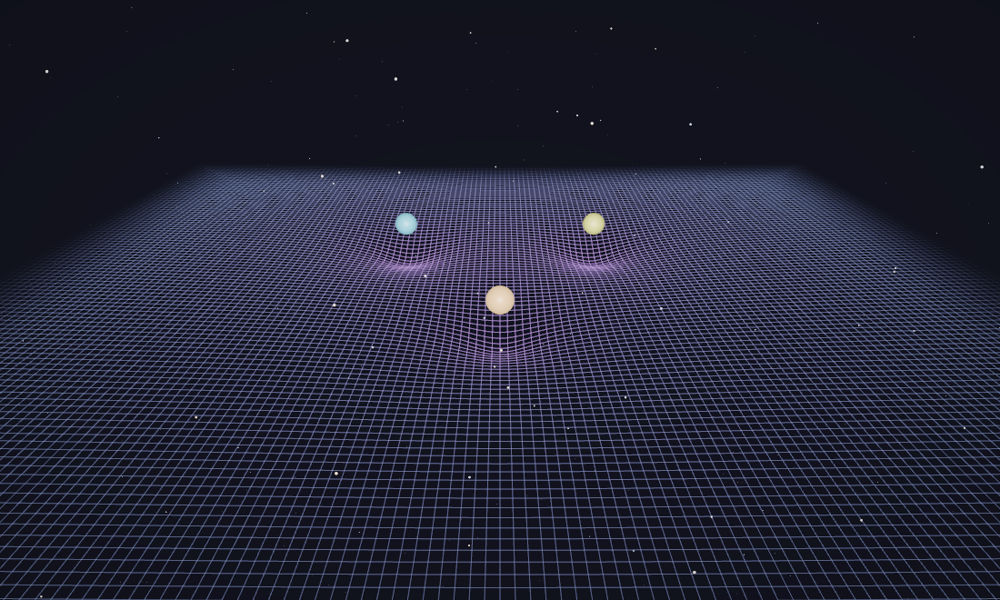

# gravitysim

An interactive Newtonian N-body simulator in C++20 and OpenGL 3.3: real
astronomical data, four selectable integrators, live conserved-quantity
diagnostics, runtime body spawning, and a GPU-deformed "spacetime" grid that is
clearly labelled as the visual analogy it is.



## What it does

- Simulates gravitational attraction between arbitrary bodies with
  `F = G m1 m2 / r^2`, in double precision, in SI units.
- Ships eleven scene presets built from real masses and semi-major axes, from a
  bouncing-ball kinematics lab to a compact object tearing through the inner
  solar system.
- Flies around in 3D, or locks the camera to any body and orbits it.
- Spawns new bodies at runtime, from the UI or the command line, which
  immediately participate in the pairwise sum.
- Reports kinetic, potential and total energy, momentum, angular momentum and
  relative energy drift, live.
- Shows osculating orbital elements for the selected body: semi-major axis,
  eccentricity, periapsis, apoapsis, period, inclination.
- Pauses, single-steps, resets, and accelerates time from 0.01x to 1e9x without
  ever enlarging the physics timestep.
- Draws a warped grid that responds to mass, as a **visualisation** -- see
  [docs/PHYSICS.md](docs/PHYSICS.md).
- Renders through an HDR pipeline with bloom, ACES tone mapping and a
  procedural starfield, so stars glow rather than being flat discs.

## Build

Requires CMake 3.24+, a C++20 compiler and an OpenGL 3.3 capable GPU. GLFW, GLM
and Dear ImGui are fetched automatically; GLAD is vendored.

```sh
cmake -S . -B build -G Ninja
cmake --build build
```

Developed with MinGW g++ 16.2 and Ninja on Windows 11 (RTX 4090). The layout is
platform-neutral; only the executable-path lookup in `engine/AssetPaths.cpp` has
a Windows-specific branch.

Run the tests:

```sh
build/bin/gravsim_tests.exe          # or: ctest --test-dir build
```

105 tests, no third-party test framework.

## Run

```sh
build/bin/gravitysim.exe                        # solar system, panels open
build/bin/gravitysim.exe --scene three-body
build/bin/gravitysim.exe --list-scenes
build/bin/gravitysim.exe --help
```

### Controls

| Key | Action |
| --- | --- |
| Hold right mouse | Look around |
| `W` `A` `S` `D` | Move |
| `Space` / `Ctrl` | Up / down |
| `Shift` / `Alt` | Faster / slower |
| Scroll | Fly speed, or orbit distance |
| `C` | Toggle orbit / free-flight camera |
| `F` | Focus the selected body |
| Left click | Select a body |
| `Tab` | Cycle selection |
| `P` | Pause / resume |
| `.` | Single step |
| `[` `]` | Halve / double time scale |
| `R` | Reset the scene |
| `N` | Spawn a body ahead of the camera |
| `G` `T` `V` `B` | Toggle grid / trails / velocity vectors / Schwarzschild radius |
| `F5` / `F12` | Reload shaders / screenshot |
| `Esc` | Release the mouse, then quit |

## Scenes

| Key | Scene |
| --- | --- |
| `bounce` | Kinematics lab: uniform 9.81 m/s^2, restitution, friction |
| `attract` | Three masses released from rest |
| `two-body` | Earth around the Sun |
| `earth-moon` | Sun, Earth and Moon at Earth-Moon scale |
| `inner` | Inner solar system |
| `solar-system` | Sun through Neptune |
| `binary` | Two solar-mass stars plus a circumbinary planet |
| `three-body` | Three stars in a chaotic configuration |
| `intruder` | A 0.8 solar-mass star falling into the inner system |
| `compact` | A 12 solar-mass compact object with a probe ring |
| `compact-vs-sun` | A 30 solar-mass object crossing the solar system |

<p align="center">
  
  
  
  
</p>

## Configuration

Every preset is also a JSON file in `configs/`. Files there are loaded at
startup and **replace** the compiled-in preset with the same key, so masses,
radii, orbital radii and initial velocities can be edited without rebuilding.

```sh
build/bin/gravitysim.exe --export-configs configs   # regenerate from code
build/bin/gravitysim.exe --no-configs               # ignore configs/
```

Numbers are written with 17 significant digits, so a save/load round trip
reproduces the same trajectory exactly -- there is a test that asserts bitwise
equality of the state after 4000 steps, not just approximate agreement.

## Unit system

SI throughout: metres, kilograms, seconds. The UI formats values for reading
(`6371000 m` becomes `6371.000 km`, `1.496e11 m` becomes `1.0000 AU`, masses in
solar or Earth masses, times in days and years) but every stored quantity is SI.

## Scale management

Three independent scales, which must never be confused:

| Name | Meaning | Read by |
| --- | --- | --- |
| physical radius | the body's true radius in metres | collisions and merging |
| `metresPerUnit` | metres per world unit | position transform only |
| body size gain/exponent | drawn-radius exaggeration | model matrix only |

**Gravity uses mass and position only.** No code in `sim/` reads a drawn radius.

Body radii are exaggerated by a *power law*, not a multiplier:

```
drawnRadius = gain * (trueRadius / metresPerUnit) ^ exponent
```

A constant multiplier cannot work here. The Sun is 109 Earth radii, so any
factor large enough to make the Earth visible draws the Sun wider than the
Earth's entire orbit -- which is exactly what the first attempt did. An exponent
below 1 compresses that ratio while preserving the ordering. `True scale` in the
Rendering panel turns the exaggeration off, at which point the planets vanish;
that is worth looking at once.

## Architecture

```
sim/      pure C++20 + glm. No OpenGL, GLFW or ImGui.
  ^
  | one-way
engine/   window, input, timing, camera, assets, screenshots
render/   shaders, meshes, renderers
ui/       ImGui panels
```

`sim/` is a separate static library and the tests link against **only** that.
If a physics change cannot be tested without opening a window, the layering has
been broken. Details in [docs/ARCHITECTURE.md](docs/ARCHITECTURE.md).

## Physics, honestly

The full statement is in [docs/PHYSICS.md](docs/PHYSICS.md). The essentials:

- **The dynamics are Newtonian.** No relativistic corrections anywhere.
- **The warped grid is a visualisation.** It is displaced by a softened
  Newtonian potential and is a strictly one-way read of simulation state.
  Nothing in the physics reads it back. It is the rubber-sheet analogy, not
  general relativity, and not a picture of curved spacetime.
- **Compact objects are not black holes.** They are Newtonian point masses with
  a small radius. Their Schwarzschild radius `r_s = 2GM/c^2` is displayed as a
  reference figure; no event horizon, lensing or time dilation is modelled.
- **Softening is a documented modification**, not a hidden fudge, and it does
  not make a close encounter *accurate* -- only finite. The error there is
  timestep resolution, which the tests demonstrate by refining the step.

## Limitations

- Orbits start as circles at the semi-major axis; real eccentricities and phases
  are not reproduced.
- All presets are coplanar, so the grid can lie in the orbital plane.
- Bodies are point masses for gravity: no oblateness, tides, rotation or axial
  tilt.
- Gravity is O(N^2). Fine for the tens of bodies these scenes use; thousands
  would need Barnes-Hut or a compute shader, which is deliberately not built.
- Lighting is not inverse-square, for readability across four orders of
  magnitude of scene scale.
- The merge model discards the kinetic energy of relative motion and does not
  conserve spin angular momentum, because rotation is not modelled.

## Verification

Rendering milestones are verified by capturing frames offscreen and inspecting
them, not by assuming a draw call worked:

```sh
build/bin/gravitysim.exe --scene inner --no-ui --warmup 24000000 \
    --screenshot out.png --frame 4
tools/capture_scenes.sh docs/images     # every preset at once
```

Runtime spawning is verified through the same code path the UI uses:

```sh
build/bin/gravitysim.exe --scene inner --spawn "Sun" --spawn-distance 14 \
    --warmup 20000000 --settle 60000000 --no-ui --screenshot spawned.png
```

That prints each body's orbital radius before and after. With no spawn the
planets move by under 0.3% over the same interval; with a star inserted at
runtime, Mercury's distance from the origin grows by 803% and Earth's by 531% --
from nothing but the extra term in the pairwise sum.

Progress and per-milestone results, including the bugs found along the way, are
in [docs/PROGRESS.md](docs/PROGRESS.md).
