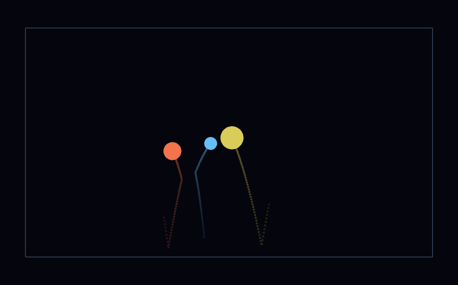
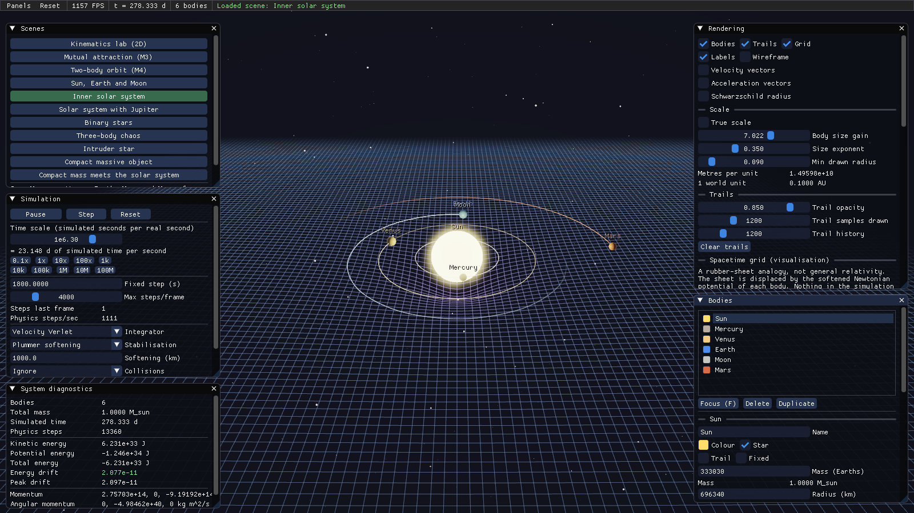
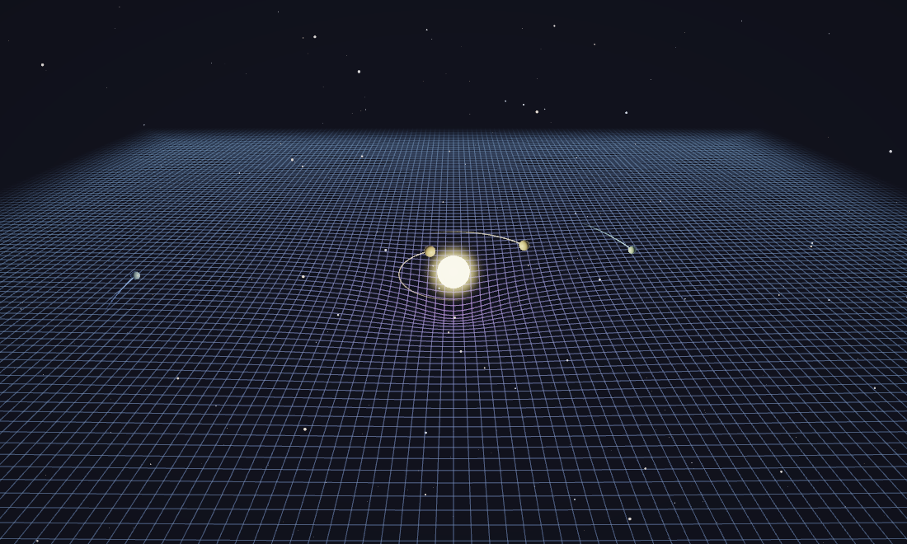
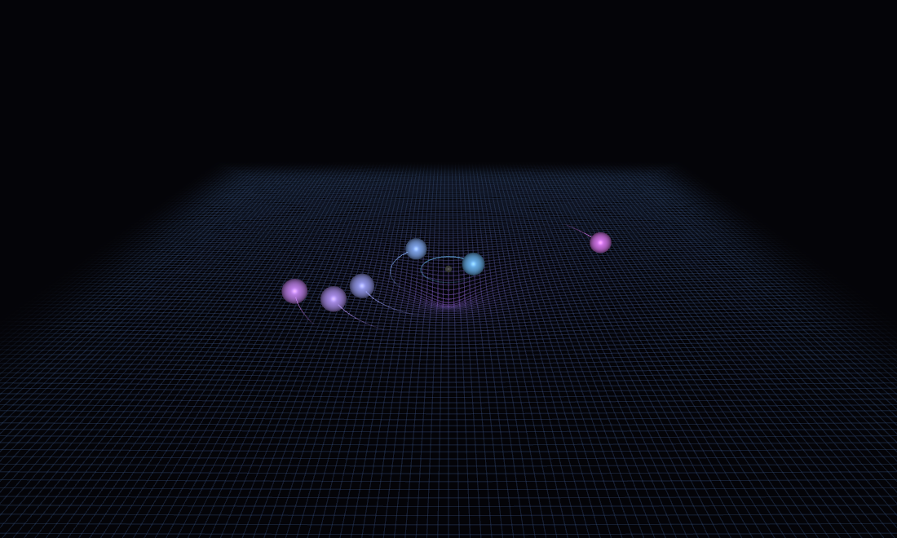

# Progress

Milestones are marked COMPLETE only after the code has been built, run, and its
behaviour checked. For rendering work that means a frame was captured offscreen
and looked at; for physics it means a test asserts the numbers.

Current state: **all twelve success criteria met**, plus a visual polish pass
and a UI hardening pass. 160 unit tests and a 41000-check application self-test,
all passing (`ctest --test-dir build`).

---

## M1 -- OpenGL window and render loop

Status: **COMPLETE**

Implemented: CMake/Ninja project, GLFW 3.4 + GLM 1.0.1 + Dear ImGui v1.91.5 via
FetchContent, vendored glad2 loader; `Window`, `Clock`, `Input`, `Application`
main loop, asset resolution, and a hand-written PNG encoder for offscreen
capture.

Build: `cmake -S . -B build -G Ninja && cmake --build build`, clean.

Run: `build/bin/universe-sim.exe --screenshot docs/images/m1_window.png --frame 5`

Tests: 6 passing (`tests/test_units.cpp`, unit formatting).

Observed: context reports `NVIDIA GeForce RTX 4090 | 3.3.0 | GLSL 3.30`.
`docs/images/m1_window.png` is a uniform `#050508` field at the requested size,
matching the clear colour -- which also confirms the PNG encoder emits valid
files.

Problems found and fixed:
1. **POST_BUILD asset staging was impossible here.** CMake wraps custom commands
   in a nested `cmd /C "cd /D <path> && ..."`, and this repository sits under a
   directory named `AI & Media`; `cmd` re-parsed the ampersand as a command
   separator and the copy failed with `'Media' is not recognized`. Replaced with
   runtime asset resolution, which also allows shader hot-reload.
2. **`glfwGetKey` spammed `GLFW_INVALID_ENUM`** ~160 times per frame: the input
   poll ran to key code 511 but `GLFW_KEY_LAST` is 348.
3. **Unit formatter chose megametres** for Earth's radius; astronomy uses km.

Known issues: none.

---

## M2 -- 2D circle mesh, kinematics, collisions

Status: **COMPLETE**

Implemented: triangle-fan circle mesh from centre + rim vertices; `CelestialBody`
with `integrate` via the shared integrators; fixed-timestep accumulator;
axis-aligned bounds with configurable restitution and friction.

Run: `build/bin/universe-sim.exe --scene bounce`

Tests: 9 (`tests/test_kinematics.cpp`). Free fall matches `y = -1/2 g t^2` to 1e-12; fall time
from 10 m matches `sqrt(2h/g)`; impact speed matches `sqrt(2gh)`; a perfectly
elastic bounce returns to the drop height; restitution 0.5 returns to a quarter
of it (the `e^2` law); friction halves tangential speed at `f = 0.5`; the ball
never leaves the box over 20 000 steps; and 120 Hz and 480 Hz stepping agree to
1e-12, which is the property that makes physics frame-rate independent.

Observed: frames captured at 0.4 s, 1.5 s and 2.6 s of simulated time show
barely-moved balls, then visibly parabolic trails, then the V of a completed
bounce.

Problems found and fixed:
1. **The test framework's `CHECK_REL` divided by `|expected|`,** so every
   assertion with a negative expected value -- potential energy, inward
   acceleration -- reported a perfect match as `-1` and failed. Six tests were
   failing for this reason alone.
2. **The momentum conservation test normalised against a total that cancelled
   to zero,** so it was measuring nothing.

---

## M3 -- Newtonian gravity between multiple bodies

Status: **COMPLETE**

Implemented: O(N^2) pairwise gravity, each unordered pair visited once with
equal-and-opposite accelerations applied together; three configurable
singularity strategies (none, Plummer softening, minimum distance).

Tests: 10 across `test_gravity.cpp` (vector maths, acceleration and
stabilisation). Acceleration matches the closed form for two 1 kg masses 1 m apart;
doubling the distance quarters the acceleration exactly; `m*a` sums to zero
across an unequal-mass pair to 1e-14; symmetric masses cancel at the midpoint;
softening matches the analytic Plummer value to 1e-10 and stays finite at zero
separation; a fixed body never accelerates.

Observed: the `attract` preset shows three masses falling together from rest,
each sitting in its own visible well.

---

## M4 -- Integrators, orbits and energy diagnostics

Status: **COMPLETE**

Implemented: explicit Euler, symplectic Euler, velocity Verlet, RK4, switchable
at runtime; energy/momentum/angular-momentum diagnostics with drift tracking;
trails with a configurable sample interval and reference frame.

Tests: 13 (`tests/test_integrators.cpp`). Velocity Verlet is exact for a constant field; RK4 tracks `cos(t)` to
1e-8 over a full period at 200 steps; explicit Euler grows an oscillator's
energy from 0.5 past 10 in 10 000 steps while symplectic Euler stays in
0.45-0.55; halving the step cuts Verlet's position error by 3-5x, confirming
second order; a circular orbit returns to its start after one period to 1e-4 of
its radius; momentum is conserved to 4e-14 over 20 000 steps; identical initial
conditions reproduce bitwise.

The energy test asserts *boundedness*, not smallness: the peak drift over orbits
1-25 is compared with orbits 26-50, which is the property that actually
distinguishes a symplectic integrator.

Observed: Earth completes exactly one revolution per Julian year (within 0.02
radians) and its orbital radius stays within 0.5% of 1 AU.

---

## M5 -- 3D rendering, camera, sphere meshes

Status: **COMPLETE**

Implemented: procedural UV spheres with pole degeneracy handled; `Shader`,
`Mesh`, `MeshFactory`, `Renderer`; fly and orbit cameras with mouse-look, WASD,
vertical movement, scroll speed control and focus-on-body; camera-relative
(floating origin) rendering; lit bodies with emissive stars, rim light and a
subtle specular.

Observed: verified across all fourteen presets; the inner system shows lit
spheres, elliptical trails and correct relative sizes.

Problems found and fixed:
1. **Uniform radius exaggeration is unusable at solar-system scale.** The Sun is
   109 Earth radii, so the multiplier that made Earth visible drew the Sun wider
   than Earth's whole orbit -- visible immediately in the first capture.
   Replaced with a power law `gain * r^exponent`, with each scene solving its own
   gain from a named reference body.
2. **The gain was solved from the largest body in the scene,** so the Earth-Moon
   preset -- which still contains the Sun, 2 992 units off screen -- drew the
   Earth six pixels across.

---

## M6 -- Scale management, solar system, time control

Status: **COMPLETE**

Implemented: `metresPerUnit` / drawn-radius exaggeration / physical radius kept
strictly separate; fourteen presets from real IAU/NASA values; JSON scene
configuration in `configs/`; `timeScale` from 0.01x to 1e9x with substepping and
a step budget; pause, single-step, reset.

Tests: 29 -- 15 in `test_scenes.cpp` and 14 in `test_json.cpp`. Every preset is well formed with unique keys and
finite state; astronomical presets have zero net momentum; the inner system's
orbital radii stay within 5% over ten simulated years; the Moon stays between
3.0e8 and 4.6e8 m of Earth over two years; energy drift over a decade peaks
below 1e-5.

Config round-trips are asserted **bitwise**: the inner system is run 4000 steps
from the built-in preset and from its saved-and-reloaded copy, and the summed
positions must be exactly equal.

---

## M7 -- Spacetime curvature grid

Status: **COMPLETE**

Implemented: wireframe or shaded XZ patch, displaced per vertex on the GPU by
the softened Newtonian potential of up to 24 nearby bodies, smoothly saturated;
configurable strength, opacity, resolution, extent, depth and well softening.
Documented throughout as a visualisation.

Observed: single well under the Sun, a merged double well for the binary, three
overlapping wells for the three-body scene.

Problems found and fixed:
1. **The patch was centred under the camera rather than under what the camera
   was looking at.** At the binary preset's 70 unit camera distance over a 55
   unit patch, the stars sat off the edge of their own sheet and had no wells at
   all.
2. **The distance fade was keyed to the grid extent,** which erased the sheet
   entirely whenever the camera was farther out than 1.6x that -- the full solar
   system view had no grid whatsoever. It now fades against the distance to the
   patch's far corner.
3. **Far-off bodies flattened everything.** The Sun, 2 992 units from a 26 unit
   patch in the Earth-Moon preset, dominated the normalisation and pushed the
   whole sheet into saturation. Wells are now culled beyond three grid extents
   and normalised against the heaviest body actually on the patch.
4. **Wells were too narrow to read** at the default softening; widened from
   0.02 to 0.055 of the extent.

---

## M8 -- Control UI, spawning, inspector, presets

Status: **COMPLETE**

Implemented: menu bar with live FPS, simulated time and body count; Scenes,
Simulation, System diagnostics, Rendering, Bodies + inspector, Spawn, and Help
panels; screen-space body labels; click-to-select via ray picking; Tab cycling;
focus, delete, duplicate; eight spawn presets; spawn ahead of the camera or at
exact coordinates.

Tests: 16 view-maths tests (`test_viewmath.cpp`), made possible by moving picking and scale maths into
`sim/ViewMath` so they need no GL context. Picking hits the body under the ray,
ignores bodies behind the camera, prefers the nearest of two, uses the drawn
radius rather than the physical one, and works at astronomical coordinates.

Problems found and fixed:
1. **Panels used hard-coded pixel positions** and ran off screen at 1280x720;
   now laid out against the live viewport.
2. **Widget labels were clipped.** ImGui puts a label to the right of a widget
   and defaults the widget to full width, so labels ran past the panel edge.

---

## M9 -- Compact objects, merging, documentation

Status: **COMPLETE**

Implemented: Schwarzschild radius computed and displayed for every body and
drawable at true scale; compact-object presets with explicit "this is not a
black hole" wording in the UI and docs; collision modes (ignore / elastic /
merge) with volume-additive radii and momentum conservation; `--spawn` and
`--settle` command-line options so runtime insertion can be verified from a
script through the same code path the UI uses.

Tests: 11 collision tests (`test_collisions.cpp`) plus the compact-object
stability tests in `test_scenes.cpp`. A merge
conserves mass and momentum, places the result at the centre of mass, and adds
volumes rather than radii; an elastic collision at restitution 1 conserves both
momentum and kinetic energy to 1e-12.

Observed: a neutron-star-like mass dropped into the inner system produces
dramatic, entirely finite orbital disruption -- Mercury's distance grows 2329%,
Earth's 815%, with no NaN, no infinity and nothing exceeding `c`.

Finding worth recording: **a close encounter is finite but not accurate.**
Dropping a compact object through a star moves the total energy by a factor of
thousands. That is timestep resolution, not the force law, and the two are
distinguishable by refining the step -- which a test now does at 600 s, 150 s and
37.5 s, requiring the drift to fall monotonically and by more than 10x overall.
Documented in `docs/PHYSICS.md`.

---

## M10 -- Visual polish

Status: **COMPLETE**

Implemented: HDR render target (multisampled `RGBA16F`) with a bright pass,
half-resolution separable Gaussian bloom, ACES filmic tone mapping, exposure and
a subtle vignette; a procedural fixed-seed starfield drawn as round point
sprites with a power-law brightness distribution and blackbody-ish tints; a
graceful fallback to direct rendering when the framebuffer cannot be created.

Emissive bodies now output well above 1.0 on purpose, so the bright pass finds
them and the tone map rolls their cores to white while the bloom halo keeps the
star's colour. That is the whole reason the target has to be floating point: at
8 bits the overflow is clipped before bloom can see it.

Run: `--no-post` and `--no-stars` disable the new work, which is how the
fallback path is exercised rather than assumed.

Observed: captured before and after across the presets. The Sun gains a real
halo, the previously empty black void has a sky, and the grid reads far better
against it. UI panels remain crisp because ImGui draws after the composite --
confirmed in `docs/images/hero.png`.

Tuning: the first pass had bloom washing out the inner planets and the starfield
competing with the grid, so the threshold went 1.0 -> 1.15, intensity 0.75 ->
0.55, star brightness 1.0 -> 0.75 and grid opacity 0.42 -> 0.34.

Known issue: stars are visible through the grid sheet, including "below" it.
That is correct for a transparent visualisation plane rather than a floor, but
it does read oddly at shallow camera angles.

---

## M11 -- UI hardening and release polish

Status: **COMPLETE**

Implemented: reset-to-defaults for rendering, simulation and camera settings,
individually and together, from both a Reset menu and per-panel buttons; a
barycentre-following camera mode; merge counts surfaced in the diagnostics
panel; a deterministic frame-sequence mode (`--sequence`) used to render the
demo clips; and `--selftest`, which drives every UI-reachable state transition
against a real GL context.

Bugs found by reading and by the self-test, not by using the app:

1. **Use-after-free in Duplicate.** `spawnBody()` push_backs into the body
   vector, which can reallocate. The handler then read `body->name` through a
   pointer into that vector to build its status message.
2. **Dangling references after deletion.** Removing a body left the selection,
   the camera focus and -- worst -- the trail reference frame pointing at an id
   that no longer existed. A dead trail frame silently reinterprets every stored
   sample as inertial, so all trails jump. Deletion now goes through
   `Application::deleteBody`, which repairs all three, and merges use the same
   path.
3. **The camera never moved in sequence mode.** `runSequence` set the orbit
   target and swept the yaw but never called `Camera::update`, so the camera
   stayed where it started and the sweep merely panned. Scenes whose bodies move
   drifted out of frame, which is why the first demo clips were mostly empty
   space.
4. **The three-body preset was using the wrong speed.** It set
   `0.9 * sqrt(GM/r)`, the circular speed about a single central mass, for a
   configuration that has three. The correct balance for an equilateral triangle
   of equal masses is `v = sqrt(G m / (sqrt(3) r))`; with the wrong value the
   triangle tore itself apart in under two years instead of orbiting. Now
   pinned by a test.
5. **Unreadable time-scale buttons.** `"%.0g"` rendered 1e4 as `1e+04x`, wider
   than the button it sat in.

Self-test: 11 scenes x (load, step, four resets, spawn, focus, delete, delete
the trail reference, all four integrators, all three stabilisation modes, delete
every body, reset while empty, reload) plus picking and JSON round-trips.
**41005 checks, 0 failures.**

One finding kept rather than fixed: in the inner-system view the Moon sits
inside the Earth's drawn sphere and cannot be clicked. That is a consequence of
the radius exaggeration, not a picking bug, so the self-test asserts the weaker
correct property -- a missed pick must be explained by an enclosing body -- and
reports the count.

---

## Success criteria

| # | Criterion | Evidence |
| --- | --- | --- |
| M1 | Window and pipeline work | `docs/images/m1_window.png`, clear colour verified |
| M2 | 2D object falls and bounces correctly | 9 tests; `e^2` rebound law verified; frames at 3 times |
| M3 | Multiple masses attract | 10 tests incl. third law to 1e-14; `attract` preset |
| M4 | Two-body orbit stays stable | One orbit per Julian year; radius within 0.5% of 1 AU |
| M5 | 3D spheres and camera work | All 11 presets captured and inspected |
| M6 | 3D gravitational orbit works | Inner system holds for a decade within 5% |
| M7 | Scaled solar-system preset runs | `docs/images/scene_solar-system.png` |
| M8 | Energy/momentum diagnostics reasonable | Peak drift < 1e-5 over a decade; momentum to 4e-14 |
| M9 | Grid responds dynamically to mass | Single, double and triple wells captured |
| M10 | Objects added at runtime | `--spawn` through the UI's own path; 7 bodies from 6 |
| M11 | An added star disrupts existing orbits | Mercury +803%, Earth +531% vs <0.3% without it |
| M12 | Extreme compact masses stay stable | All finite, sub-`c`; drift shown to be step-resolution |

---

## Not built, deliberately

- Any relativistic physics. The seam is `GravitySystem::accelerations` plus the
  `ForceModel` interface; see the end of `docs/PHYSICS.md`.
- Barnes-Hut, octrees or compute-shader gravity. O(N^2) is entirely adequate for
  the tens of bodies these scenes use.
- Bloom and other post-processing.
- Real ephemeris data. Orbits start as circles at the semi-major axis, which
  keeps initial conditions deterministic and legible.
